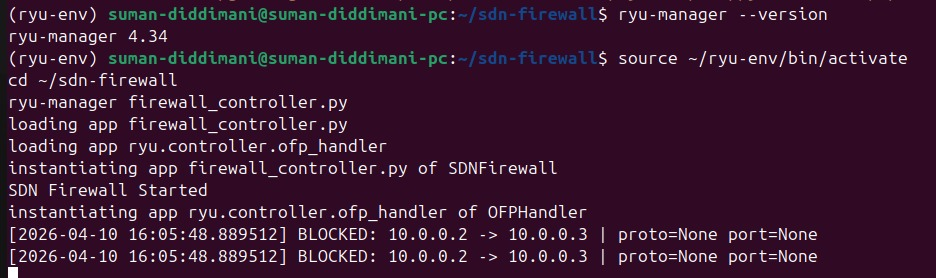
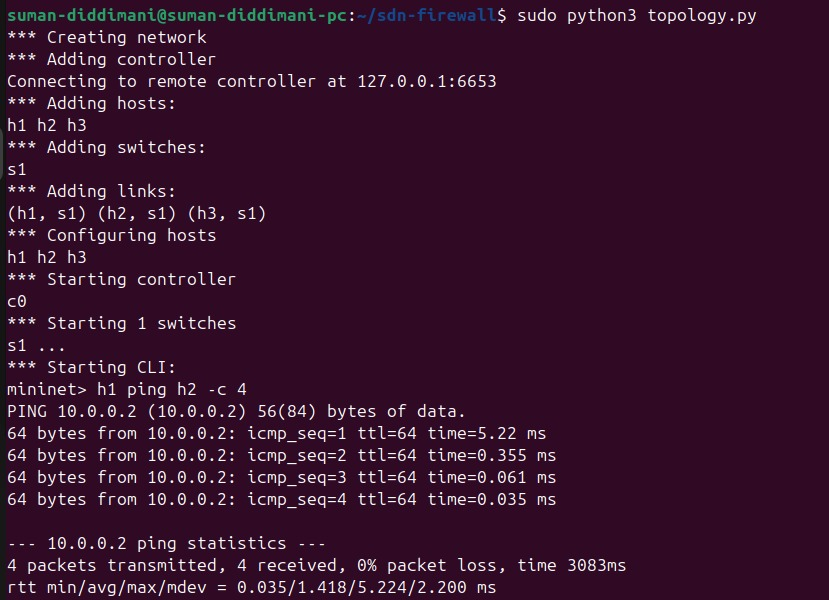
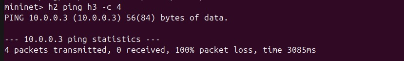
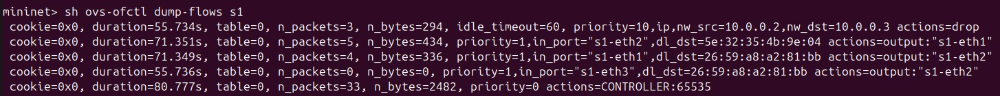
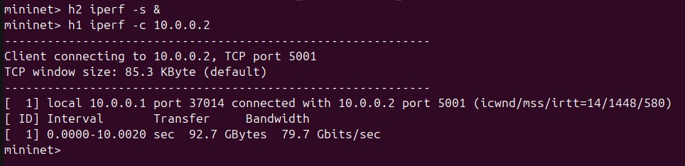

# SDN-Based Firewall using Mininet and Ryu Controller

## Problem Statement

In traditional networks, firewalls are hardware-based and difficult to configure dynamically. This project implements a **Software-Defined Networking (SDN) based firewall** using **Mininet** and the **Ryu OpenFlow controller**. The controller dynamically installs flow rules to block or allow traffic between hosts based on predefined rules (IP/MAC/port), demonstrating the power of centralized, programmable network control.

---

## Objectives

- Implement a controller-based firewall using OpenFlow
- Block/allow traffic between hosts using rule-based filtering
- Install DROP rules dynamically via the Ryu controller
- Test and validate allowed vs blocked traffic scenarios
- Measure network performance using ping and iperf
- Maintain logs of all blocked packets

---

## Network Topology

```
    h1 (10.0.0.1)
         |
    s1 (OpenFlow Switch)  <------>  Ryu Controller
         |          |
    h2 (10.0.0.2)  h3 (10.0.0.3)
```

- **3 hosts** connected to **1 switch**
- **Remote Ryu controller** manages all flow rules
- Firewall rules enforced at the controller level

---

## Firewall Rules Implemented

| Rule | Source | Destination | Protocol | Port | Action |
|------|--------|-------------|----------|------|--------|
| 1 | 10.0.0.2 | 10.0.0.3 | Any | Any | BLOCK |
| 2 | 10.0.0.1 | 10.0.0.3 | TCP | 80 | BLOCK |
| Default | Any | Any | Any | Any | ALLOW |

---

## Setup & Installation

### Prerequisites
- Ubuntu 20.04 / 22.04 (or 24.04 with Python 3.9)
- Mininet
- Ryu Controller
- iperf, Wireshark (optional)

### Step 1 — Install Mininet
```bash
sudo apt update
sudo apt install mininet -y
```

### Step 2 — Install Python 3.9 (required for Ryu)
```bash
sudo add-apt-repository ppa:deadsnakes/ppa -y
sudo apt update
sudo apt install python3.9 python3.9-venv python3.9-dev -y
```

### Step 3 — Create Virtual Environment
```bash
python3.9 -m venv ~/ryu-env
source ~/ryu-env/bin/activate
```

### Step 4 — Install Ryu Controller
```bash
pip install pip==21.3.1 setuptools==58.0.0 wheel==0.37.0
pip install eventlet==0.30.2
pip install --no-build-isolation ryu
```

### Step 5 — Clone this Repository
```bash
git clone https://github.com/SumanDiddimani/SDN-Based-Firewall.git
cd SDN-Based-Firewall
```

---

## Execution Steps

### Terminal 1 — Start Ryu Controller
```bash
source ~/ryu-env/bin/activate
cd SDN-Based-Firewall
ryu-manager firewall_controller.py
```
Wait until you see:
```
instantiating app firewall_controller.py of SDNFirewall
SDN Firewall Started
```

### Terminal 2 — Start Mininet Topology
```bash
cd SDN-Based-Firewall
sudo python3 topology.py
```

---

## Test Scenarios

### Test 1 — Allowed Traffic (h1 → h2)
```bash
mininet> h1 ping h2 -c 4
```
**Expected Output:**
```
4 packets transmitted, 4 received, 0% packet loss
```

### Test 2 — Blocked Traffic (h2 → h3)
```bash
mininet> h2 ping h3 -c 4
```
**Expected Output:**
```
4 packets transmitted, 0 received, 100% packet loss
```

### Test 3 — View Flow Table
```bash
mininet> sh ovs-ofctl dump-flows s1
```
**Expected Output:** Shows DROP rule for 10.0.0.2 → 10.0.0.3 with priority=10

### Test 4 — Throughput Test (iperf)
```bash
mininet> h2 iperf -s &
mininet> h1 iperf -c 10.0.0.2
```

---

## Expected Output

| Test | Result |
|------|--------|
| h1 ping h2 | ✅ 0% packet loss (Allowed) |
| h2 ping h3 | ❌ 100% packet loss (Blocked) |
| Flow table | DROP rule installed for blocked traffic |
| Firewall log | Blocked packets logged with timestamp |
| iperf | Bandwidth measurement between allowed hosts |

---

## Proof of Execution

### Ryu Controller — Firewall Blocking Log


### Allowed Traffic — h1 ping h2


### Blocked Traffic — h2 ping h3


### Flow Table — ovs-ofctl dump-flows s1


### iperf Throughput Test


---

## Project Structure

```
SDN-Based-Firewall/
├── firewall_controller.py   # Ryu controller with firewall logic
├── topology.py              # Mininet 3-host topology
├── firewall_log.txt         # Auto-generated blocked packet log
├── README.md                # Project documentation
└── screenshots/             # Proof of execution screenshots
    ├── ryu_controller.png
    ├── allowed_traffic.png
    ├── blocked_traffic.png
    ├── flow_table.png
    └── iperf_result.png
```

---

## SDN Concepts Used

- **OpenFlow 1.3** — Protocol between controller and switch
- **packet_in events** — Unmatched packets sent to controller
- **Flow rules (match-action)** — Match IP/port, action = forward or drop
- **Priority-based rules** — Higher priority DROP rules override default ALLOW
- **Idle timeout** — Flow rules expire after 60 seconds of inactivity

---

## Performance Observations

| Metric | Value |
|--------|-------|
| Ping latency (allowed) | ~0.035ms - 5.22ms |
| Packet loss (blocked) | 100% |
| iperf throughput | ~79.7 Gbits/sec |
| Flow rule installation | Instant on first packet_in |

---

## References

1. Mininet Documentation — http://mininet.org
2. Ryu SDN Framework — https://ryu-sdn.org
3. OpenFlow Specification v1.3 — https://opennetworking.org
4. Open vSwitch Documentation — https://www.openvswitch.org
